# RepoAI - RAG Based Repository Analysis

## Problem

Understanding large codebases is time-consuming. Developers spend hours searching files, tracing dependencies, understanding architecture, and onboarding into unfamiliar repositories.

## Solution

RepoAI converts any Git repository into an AI-powered knowledge base. It analyzes source code, generates embeddings, stores them in a vector database, and enables developers to ask natural language questions about the codebase.

## Features

- GitHub URL & ZIP repository ingestion
- Tree-sitter based code analysis
- Function, class, method, route, and component extraction
- Dependency and code flow analysis
- Semantic code chunk generation
- RAG (Retrieval-Augmented Generation)
- BAAI/bge-base-en-v1.5 embedding generation
- PostgreSQL + pgvector vector database
- Semantic code search using cosine similarity
- AI-powered repository chat
- Architecture discovery and tracing
- JWT Authentication
- Google OAuth Integration
- Razorpay Payment Integration
- Multi-user repository access
- Context-window optimization for accurate AI responses

## Tech Stack

### Frontend

- React
- TypeScript
- Vite
- Tailwind CSS

### Backend

- Node.js
- Express.js
- PostgreSQL
- Gemini API

### Worker

- Python
- FastAPI
- Tree-sitter
- Sentence Transformers

## Workflow

```text
Repository Upload
        ↓
Repository Analysis
        ↓
Symbol & Dependency Extraction
        ↓
Code Chunk Generation
        ↓
Embedding Generation
        ↓
PostgreSQL (pgvector)
        ↓
User Query
        ↓
Semantic Retrieval
        ↓
Context Construction
        ↓
LLM Response
```

## Architecture

```text
React Frontend
       ↓
Express Backend
       ↓
PostgreSQL + pgvector
       ↓
FastAPI Analysis Worker
       ↓
LLM + RAG Pipeline
```

## Key Highlights

- AI-powered repository understanding
- Semantic code search
- Vector-based retrieval
- Repository-specific RAG pipeline
- Automated architecture analysis
- Scalable worker-based processing
- Production-ready authentication and payments

images : 

## Screenshots

| | |
|---|---|
| 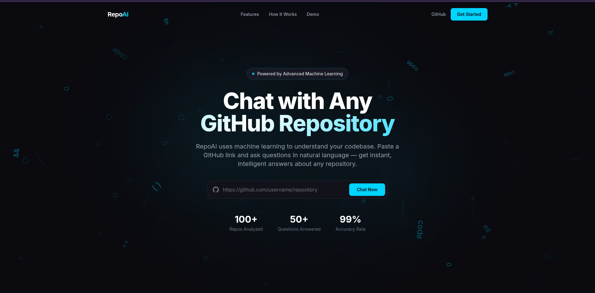 | 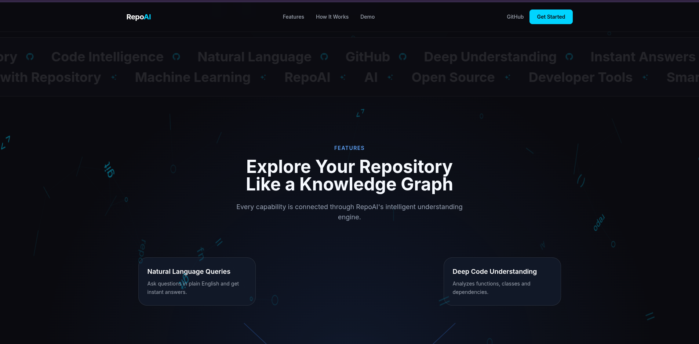 |
| 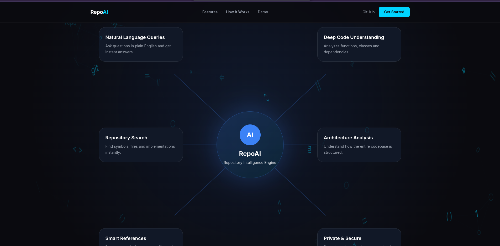 | 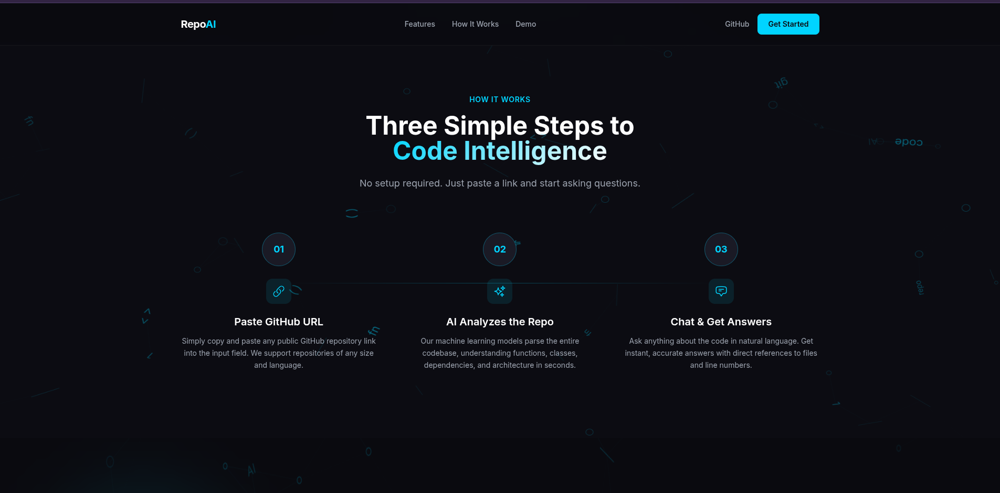 |
| 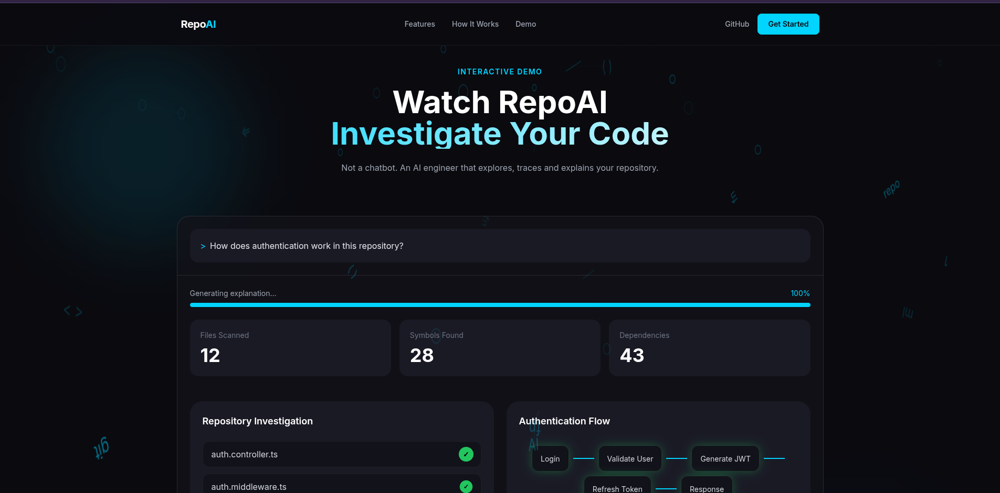 | 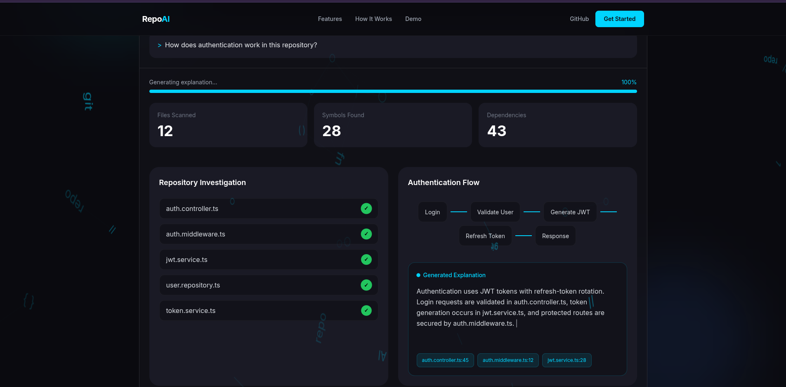 |
| 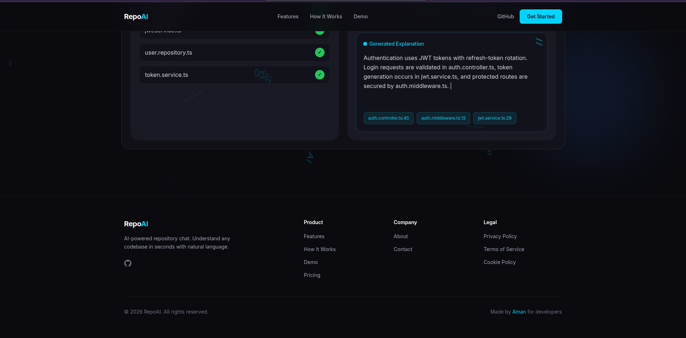 | 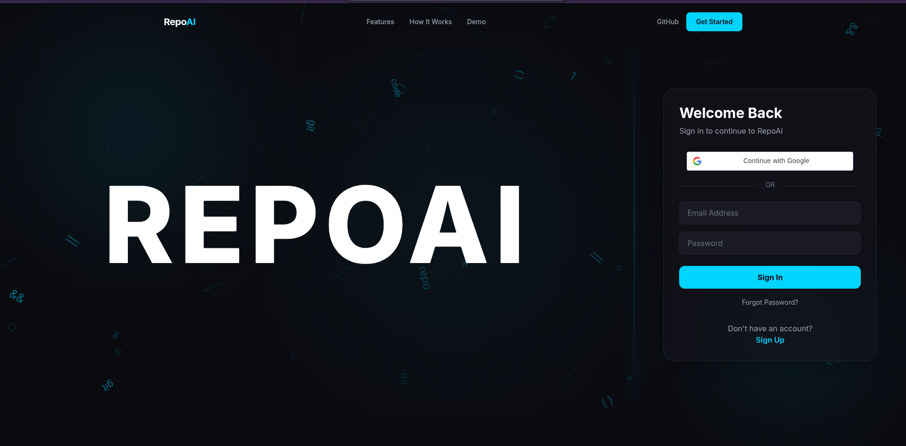 |
| 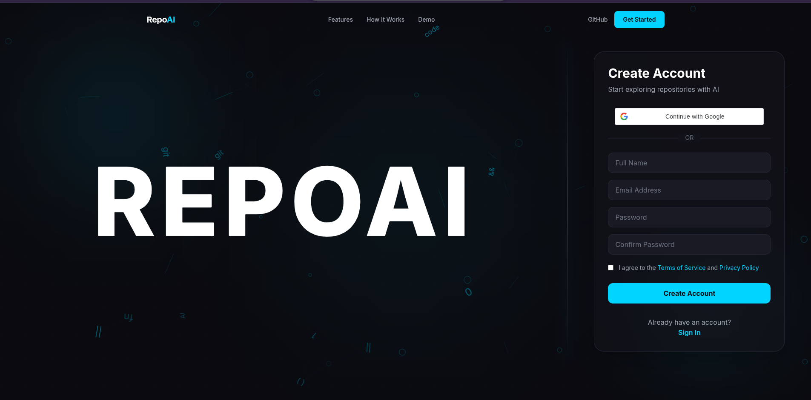 | 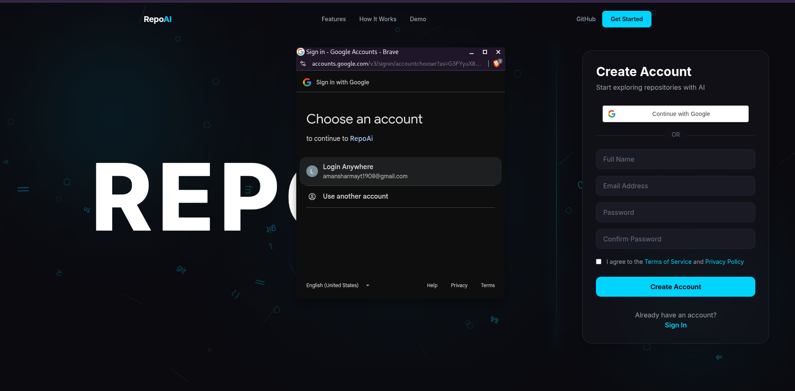 |
| 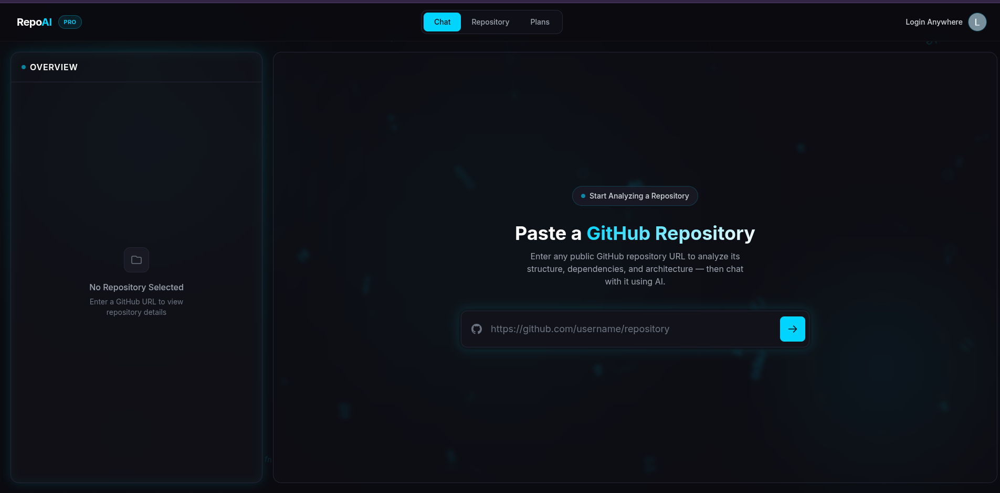 | 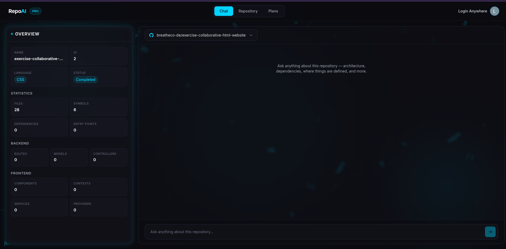 |
| 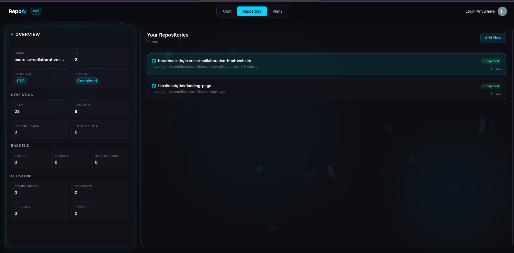 | 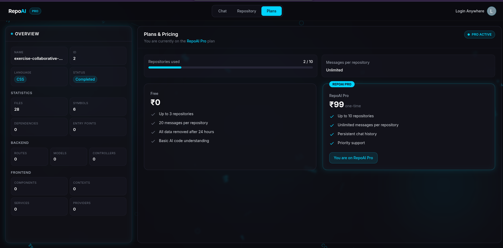 |
| 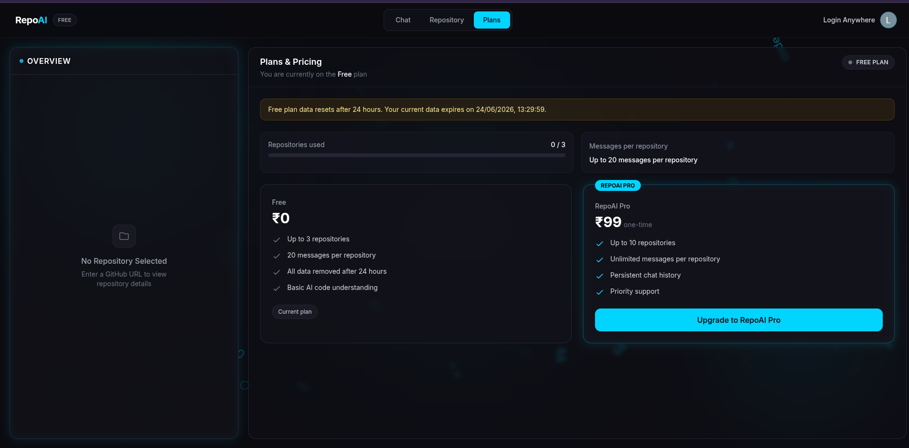 | 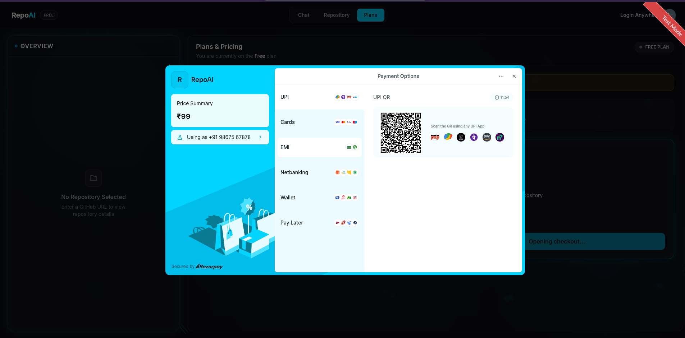 |
| 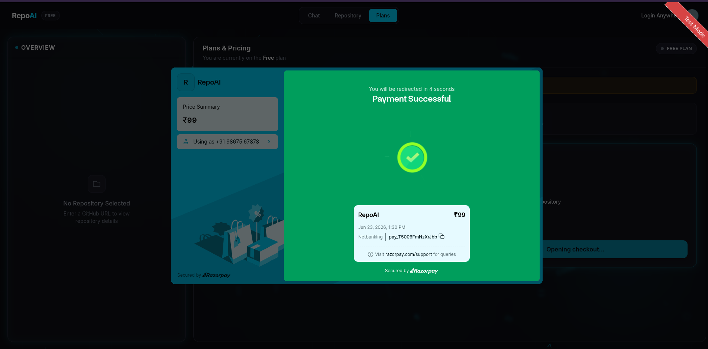 | 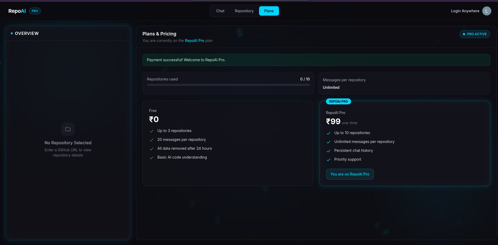 |


